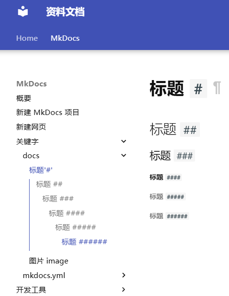

# 标题标记（Hash）

**`#` 是 Markdown 中用于创建标题（heading）的标记符号。**

---

!!! note "读法"
    英语："hash" /hæʃ/  
    日语：ハッシュ

---

!!! info "用途"
    - `#` 用于定义文档结构和分层，渲染为 HTML 的 `<h1>` ~ `<h6>`
    - 支持自动生成文档的目录导航（TOC, Table of Contents）
    - 在 MkDocs 中，`#` 标题会生成锚点，可用于页面跳转和导航定位

---

!!! tip "标准语法"
    `#` 标题语法为 **Markdown 原生语法**，所有支持 Markdown 的编辑器、平台、构建工具（如 MkDocs、Typora、VS Code、GitHub 等）都可通用。  
    **无需任何扩展或插件。**

---

<h2>如何写标题</h2>

在单词或短语前添加 1~6 个 `#`，数量对应标题级别。

=== "markdown"
    ```markdown
    # 一级标题
    ## 二级标题
    ### 三级标题
    #### 四级标题
    ##### 五级标题
    ###### 六级标题
    ```

    - 标题前使用 1~6 个 `#` 符号分别表示 1~6 级标题
    - `#` 后需有 1 个空格再写标题内容
    - 标题级别用于构建页面结构（H1~H6 对应 HTML 标签）
=== "view"
    
---

- `#` 后需有 1 个空格再写标题内容
- 标题级别用于构建页面结构（H1~H6 对应 HTML 标签）

| Markdown            | HTML                      | 渲染效果         |
|---------------------|---------------------------|-----------------|
| `# 一级标题`        | `<h1>一级标题</h1>`        | 一级标题         |
| `## 二级标题`       | `<h2>二级标题</h2>`        | 二级标题         |
| `### 三级标题`      | `<h3>三级标题</h3>`        | 三级标题         |

---

**兼容性建议**

> 标题前后建议留空行，`#` 和标题内容之间要有空格。

**替代语法**

还可以用下划线风格：

```markdown
一级标题
========

二级标题
--------
```

<h2>规范书写与建议</h2>

!!! tip "常见建议与注意事项"
    - 每页只建议有**一个一级标题**（`#`）。多个一级标题会影响页面主标题和目录（TOC）显示。
    - 主体结构建议用二级（`##`）、三级标题（`###`），四级及以下仅特殊分节使用。
    - 标题应言简意赅，利于自动目录生成和页面美观。
    - MkDocs 会根据标题自动生成锚点跳转，便于查阅和引用。

---

