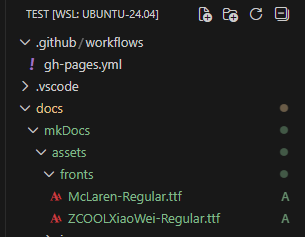

# MkDocs Material 字体设置

Material for MkDocs 支持快速切换字体，既能用 Google Fonts，也可以自定义字体。

---

<h2>基本用法</h2>

<h3>普通文本字体设置</h3>

在 `mkdocs.yml` 配置主题字体：

```yaml
theme:
  font:
    text: Roboto     # 这里填你希望用的 Google Fonts 字体名
```

!!! note "主题将自动加载以下权重：300、400、400i、700（覆盖标题、正文、导航等所有区域）"
    === "code"
        ```html
        <div style="background: #f1667dff; padding: 10px; border-radius: 8px;">
        示例字体：<span style="font-family: 'Roboto', sans-serif; font-size: 18px;">
        Roboto 字体效果 ABCD abcd 你好
        </span>
        </div>
        ```
    === "view"
        <div style="background: #f1667dff; padding: 10px; border-radius: 8px;">
        示例字体：<span style="font-family: 'Roboto', sans-serif; font-size: 18px;">
        Roboto 字体效果 ABCD abcd 你好
        </span>
        </div>

<details>
<summary>关于字重（weight）：<strong>300、400、400i、700</strong></summary>

<div style="margin-top:8px;margin-bottom:8px;">
<b>什么是字体自重（weight）？</b><br>
字体自重是字体的粗细程度，不同数值代表不同粗细或样式。常见如下：

<ul style="line-height:2;margin:8px 0;">
<li><b>300</b> —— Light（细体，纤细优雅）</li>
<li><b>400</b> —— Regular（常规体，网页默认粗细）</li>
<li><b>400i</b> —— Regular Italic（常规斜体，<i>i 表示 italic，适合引用/术语解释等斜体文本</i>）</li>
<li><b>700</b> —— Bold（粗体，强调或标题显示）</li>
</ul>

<b>实际页面如何体现？</b><br>
当你设置如 <code>Roboto</code> 作为字体时，Material for MkDocs 会自动拉取这四种不同自重和样式，页面的不同区域会自动用适合的粗细：
<ul style="line-height:2;">
<li>正文、普通文字：<b>400 Regular</b></li>
<li>导航栏、次要说明：<b>300 Light</b></li>
<li>标题、强调加粗：<b>700 Bold</b></li>
<li>斜体语句、引用：<b>400i Regular Italic</b></li>
</ul>
这样能让网页信息层次更分明，让你的文档风格更加美观、易读。
</div>

<details>
<summary>示例字体效果（点击展开）</summary>
<div style="background: #f1667dff; padding: 10px; border-radius: 8px;">
  <div>
    <span style="font-family: 'Roboto', sans-serif; font-size: 18px; font-weight:300;">Roboto 细体 (300): ABCD abcd 你好</span>
  </div>
  <div>
    <span style="font-family: 'Roboto', sans-serif; font-size: 18px; font-weight:400;">Roboto 常规体 (400): ABCD abcd 你好</span>
  </div>
  <div>
    <span style="font-family: 'Roboto', sans-serif; font-size: 18px; font-weight:400; font-style:italic;">Roboto 常规斜体 (400i): ABCD abcd 你好</span>
  </div>
  <div>
    <span style="font-family: 'Roboto', sans-serif; font-size: 18px; font-weight:700;">Roboto 粗体 (700): ABCD abcd 你好</span>
  </div>
</div>
</details>
</details>

---

<h3>等宽字体（代码区）设置</h3>

用于代码块：

```yaml
theme:
  font:
    code: Roboto Mono   # 代码块区专用 Google Fonts 字体名
```
!!! note "代码块自动启用 400 权重"
    <div style="background: #222; color: #eee; font-family: 'Roboto Mono', monospace; font-size: 17px; padding: 10px; border-radius: 8px;">
    let x = "Hello, 世界！"
    </div>

---

<h2>自定义与进阶</h2>

<h3>禁止 Google Fonts 加载，纯用系统字体</h3>
!!! note "适用于隐私或离线部署需求"
    在 `mkdocs.yml` 设置：
    ```yaml
    theme:
      font: false   # 完全禁用自动字体加载
    ```
    效果：所有内容将只使用浏览器和系统默认字体。

---

<h3>自定义加载其它字体（自托管/第三方 CDN）</h3>

!!! note "自定义字体方法"
    === "引入网络字体"
        **第一步：引入所需 Google 字体**  
        在 CSS 文件头部加入：
        ```css
        @import url("https://fonts.googleapis.com/css2?family=McLaren&family=ZCOOL+XiaoWei&display=swap");
        ```

        **第二步：设置字体优先级**
        ```css
        /* 让浏览器自动按语言选择字体，McLaren 优先用于英文，ZCOOL XiaoWei 优先用于中文 */
        html, body, code {
          font-family:
            "McLaren",          /* 英文字体 */
            "ZCOOL XiaoWei",    /* 中文字体，适配简体 */
            "Microsoft YaHei",  /* Windows/Office 常用中文fallback */
            sans-serif;         /* 通用无衬线备选 */
        }
        ```

        **第三步：在 `mkdocs.yml` 引入自定义样式：**
        ```yaml
        extra_css:
          - extra.css
        ```

    === "加载本地字体"
        **第一步：下载所需字体文件（如从 [Google Fonts](https://fonts.google.com/?preview.text=McLaren)）**

        **第二步：将字体文件存入项目如下位置**  
        

        **第三步：在 CSS 中声明本地字体**
        ```css
        @font-face {
          font-family: "McLaren"; /* 自定义英文字体名称 */
          src: url("assets/fonts/McLaren-Regular.ttf") format("truetype");   /* 网站根目录起的访问路径 */
          font-weight: 400;
          font-style: normal;
        }

        @font-face {
          font-family: "ZCOOL XiaoWei"; /* 自定义中文字体名称 */
          src: url("assets/fonts/ZCOOLXiaoWei-Regular.ttf") format("truetype");
          font-weight: 400;
          font-style: normal;
        }

        :root {
          --md-text-font: "McLaren", "ZCOOL XiaoWei";
        }
        ```
        
        **第四步：设置通用字体优先级（推荐放到 extra.css 结尾）**
        ```css
        html, body, code {
          font-family:
            "McLaren",
            "ZCOOL XiaoWei",
            "Microsoft YaHei",
            sans-serif;
        }
        ```

        **第五步：在 `mkdocs.yml` 引入自定义样式：**
        ```yaml
        extra_css:
          - extra.css
        ```

---
> **小结**：本地字体方式能保证离线和内网部署字体效果一致。注意发布网站时需将字体文件一并放在对应目录。

<h2>官方参考文档</h2>

<li><a href="https://squidfunk.github.io/mkdocs-material/setup/changing-the-fonts/">官方字体配置说明</a></li>
<li><a href="https://squidfunk.github.io/mkdocs-material/setup/setting-up-privacy/">Material 隐私/自托管插件说明</a></li>

---

> 结论：Material for MkDocs 字体设置灵活，无论你要 Google Fonts、系统字体还是自定义托管都可以轻松实现；支持代码区与正文区分开配置，品牌字体也可自定义。
