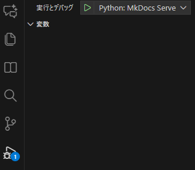

# 自动启动脚本

在 MkDocs 文档开发测试时，通常需要先用后台命令 `mkdocs serve` 启动服务，再手动输入 URL 打开浏览器查看内容。页面关闭后，后台服务器还会继续占用端口，需要手动查找并关闭进程，操作不便。

本文提供两个可选的自动启动浏览器脚本，助你方便测试，无需手动输入 URL。其中 Python 方案可方便关闭进程，推荐使用。

---

<h2>依赖项安装</h2>

建议在 WSL 环境下操作。  

1. 安装 `wslview`（来自 wslu 工具集，用于在 Windows 中打开 URL）：
    ```bash
    sudo apt update
    sudo apt install wslu
    ```
2. 检查是否安装成功：
    ```bash
    which wslview
    ```
    若能输出路径即为安装成功。

---

=== "脚本一：serve.py（推荐 / 自动释放端口）"

    ```python
    import subprocess
    import time
    import sys
    import shutil

    PORT = 8206  # 替换成你希望使用的端口号，例如 8206

    # 检查 wslview 是否存在
    if shutil.which("wslview") is None:
        print("wslview 未安装，请先运行：sudo apt install wslu")
        sys.exit(1)

    # 启动 MkDocs serve
    proc = subprocess.Popen(["mkdocs", "serve", "-a", f"127.0.0.1:{PORT}"])

    # 等待 1 秒让服务器启动
    time.sleep(1)

    # 打开浏览器
    subprocess.run(["wslview", f"http://127.0.0.1:{PORT}"])

    # 阻塞等待 MkDocs 结束
    proc.wait()
    ```

    在 `.vscode/launch.json` 添加如下配置，用于一键调试：

    ```json
    {
        "version": "0.2.0",
        "configurations": [
            {
                "name": "Python: MkDocs Serve",
                "type": "python",
                "request": "launch",
                "program": "${workspaceFolder}/serve.py",
                "console": "integratedTerminal"
            }
        ]
    }
    ```

    **使用方法：**  
    - 运行 `python serve.py` 或通过 VSCode 的 F5 快捷键直接调试，即可自动启动 MkDocs 并打开页面  
      
    - 停止调试或 Ctrl+C 结束，端口会自动释放，无需手动查杀进程  


=== "脚本二：serve.sh（简单 Bash 版 / 端口需手动释放）"

    ```bash
    #!/bin/bash

    # -----------------------------
    # MkDocs 一键启动脚本 (WSL)
    # -----------------------------

    # 配置端口
    PORT=8206  # 替换为你想要使用的端口号

    # 检查 wslview 是否安装
    if ! command -v wslview &> /dev/null
    then
        echo "wslview 未安装，请先运行：sudo apt install wslu"
        exit 1
    fi

    # 启动 MkDocs serve（后台运行）
    echo "启动 MkDocs serve 在端口 $PORT ..."
    mkdocs serve -a 127.0.0.1:$PORT &

    # 获取 MkDocs 进程 PID
    MKDOCS_PID=$!

    # 等待 1 秒，让服务器启动
    sleep 1

    # 自动在 Windows 浏览器打开
    wslview http://127.0.0.1:$PORT

    # 等待 MkDocs 服务结束（可 Ctrl+C 终止，但端口进程不会自动回收）
    wait $MKDOCS_PID
    ```

    **首次使用前给予执行权限：**
    ```bash
    chmod +x serve.sh
    ```

    **启动测试：**
    ```bash
    ./serve.sh
    ```

    **如需手动关闭端口：**

    1. 查询占用端口进程
        ```bash
        lsof -i :8206    # 替换为你的端口号
        ```
    2. 结束进程
        ```bash
        kill <PID>
        ```

---

<h2>建议</h2>

- **推荐使用 Python 脚本**：方便集成到 VSCode，Ctrl+C 停止时端口自动释放，无需手动杀进程；
- Bash 脚本没有自动管理后台端口功能，适合简单场景；
- 记得根据实际端口修改 `PORT` 变量。

---