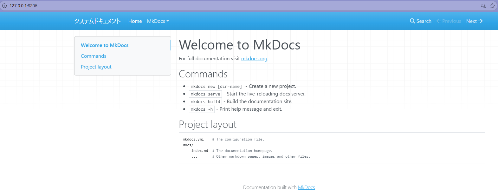

# 新建 MkDocs 项目

<h2>环境构筑</h2>

* **创建新的MkDocs工作文件夹**
    ```
    mkdir [file-name](eg:sysdocs)
    ```
* **进入MkDocs目录**
    ```
    cd [file-name](eg:sysdocs)
    ```
* **查看python版本，3.8以上**
    ```
    python --version
    ```
* **安装 MkDocs**
    ```
    pip install mkdocs mkdocs-material
    ```
* **新建MkDocs程序**
    ```
    mkdocs new .
    ```
* **启动测试**
    ```
    mkdocs serve
    ```
* **打开浏览器，输入**
    ```
    http://127.0.0.1:8000/
    ```
**显示页面，环境构筑完毕**


<h3>关闭启动中的端口</h3>

* 当关闭测试页面时，后台程序并不会自动关闭测试端口，此时如果再次启动测试`mkdocs serve`的话，会显示端口冲突错误  
  所以此时需要手动关闭后台端口

**1. 查找占用端口的进程**
    ```
    lsof -i :[端口地址](eg:8000)
    ```
**2. 关闭启动中的端口**
    ```
    kill [启动中的进程码](eg:45631)
    ```

<h3>修改端口地址</h3>

* 可以不使用127.0.0.1:8000，因为大多数程序启动时，都会默认使用8000终端，  
  所以手动改写为其他地址，以预防终端地址冲突(端口地址小于 1024 的需要 root 权限，尽量使用8000＋端口)
    ```
    mkdocs serve -a 127.0.0.1:[地址](eg:8206)
    ```